# AutoWeave ERP - Use Case Diagram

## System Overview
AutoWeave ERP is a comprehensive textile manufacturing management system that integrates production, workforce, order, and financial management.

## Actors

### Primary Actors
1. **Admin** - System administrator with full access
2. **Worker** - Factory floor worker
3. **Customer** - External customer placing orders

### Secondary Actors
1. **Payment Gateway** (Razorpay) - External payment processing
2. **Email Service** - Notification system

## Use Cases

### Authentication Module
- **UC-01: Login** - User authentication
- **UC-02: Logout** - User session termination
- **UC-03: Reset Password** - Password recovery

### Dashboard Module
- **UC-04: View Dashboard** - Real-time system overview
- **UC-05: View Analytics** - Production charts and metrics
- **UC-06: View Reports Summary** - Quick report access

### Machine Management Module
- **UC-07: Register Machine** - Add new loom/machine
- **UC-08: Update Machine Status** - Change operational status
- **UC-09: Monitor Machine Performance** - Real-time tracking
- **UC-10: Schedule Maintenance** - Plan machine maintenance
- **UC-11: View Machine History** - Performance and maintenance logs

### Order Management Module
- **UC-12: Create Order** - New customer order entry
- **UC-13: Update Order Status** - Track order progress
- **UC-14: View Order List** - List/Grid view of orders
- **UC-15: Assign Order to Production** - Link orders to machines
- **UC-16: Track Order Fulfillment** - Monitor completion status

### Production Management Module
- **UC-17: Record Production Data** - Daily production entry
- **UC-18: Monitor Production Targets** - Track vs actual output
- **UC-19: Manage Shifts** - Shift scheduling and tracking
- **UC-20: Track Quality Metrics** - Defect rate monitoring
- **UC-21: Generate Production Reports** - Daily/weekly production stats

### Worker Management Module
- **UC-22: Register Worker** - Add new employee
- **UC-23: Manage Attendance** - Track worker presence
- **UC-24: Assign Shifts** - Schedule worker shifts
- **UC-25: Track Performance** - Worker productivity metrics
- **UC-26: Update Worker Profile** - Personal information management

### Payroll Module
- **UC-27: Calculate Salary** - Process payroll calculations
- **UC-28: Generate Payslips** - Create salary statements
- **UC-29: Process Payments** - Handle salary disbursements
- **UC-30: Manage Payment History** - Transaction records

### Reports Module
- **UC-31: Generate Production Reports** - PDF/Excel production data
- **UC-32: Generate Financial Reports** - Revenue and cost analysis
- **UC-33: Generate Worker Reports** - Performance and attendance
- **UC-34: Generate Machine Reports** - Utilization and maintenance
- **UC-35: Schedule Reports** - Automated report generation

### Settings Module
- **UC-36: Manage User Accounts** - User administration
- **UC-37: Configure System Settings** - System preferences
- **UC-38: Manage Permissions** - Role-based access control
- **UC-39: Backup Data** - System data backup
- **UC-40: Configure Notifications** - Email and alert settings

## Use Case Relationships

### Include Relationships
- **UC-04: View Dashboard** includes **UC-05: View Analytics**
- **UC-13: Update Order Status** includes **UC-17: Record Production Data**
- **UC-27: Calculate Salary** includes **UC-24: Assign Shifts**
- **UC-31: Generate Production Reports** includes **UC-17: Record Production Data**

### Extend Relationships
- **UC-03: Reset Password** extends **UC-01: Login**
- **UC-10: Schedule Maintenance** extends **UC-08: Update Machine Status**
- **UC-35: Schedule Reports** extends **UC-31: Generate Production Reports**

### Generalization Relationships
- **Admin** can perform all use cases
- **Worker** can perform limited use cases (view dashboard, update profile, view attendance)
- **Customer** can perform order-related use cases (create order, track fulfillment)

## Access Matrix

| Use Case | Admin | Worker | Customer |
|----------|-------|--------|---------|
| UC-01: Login | ✓ | ✓ | ✗ |
| UC-04: View Dashboard | ✓ | ✓ | ✗ |
| UC-07: Register Machine | ✓ | ✗ | ✗ |
| UC-12: Create Order | ✓ | ✗ | ✓ |
| UC-17: Record Production | ✓ | ✗ | ✗ |
| UC-22: Register Worker | ✓ | ✗ | ✗ |
| UC-27: Calculate Salary | ✓ | ✗ | ✗ |
| UC-31: Generate Reports | ✓ | ✗ | ✗ |
| UC-36: Manage Users | ✓ | ✗ | ✗ |

## System Boundaries

### Internal Systems
- AutoWeave ERP Application
- Database (MongoDB)
- Authentication Service

### External Systems
- Razorpay Payment Gateway
- Email Service (Nodemailer)
- Customer Portal

## Mermaid Diagram Code

```mermaid
graph TD
    subgraph "AutoWeave ERP System"
        subgraph "Authentication"
            UC01[Login]
            UC02[Logout]
            UC03[Reset Password]
        end
        
        subgraph "Dashboard"
            UC04[View Dashboard]
            UC05[View Analytics]
            UC06[View Reports Summary]
        end
        
        subgraph "Machine Management"
            UC07[Register Machine]
            UC08[Update Machine Status]
            UC09[Monitor Machine Performance]
            UC10[Schedule Maintenance]
            UC11[View Machine History]
        end
        
        subgraph "Order Management"
            UC12[Create Order]
            UC13[Update Order Status]
            UC14[View Order List]
            UC15[Assign Order to Production]
            UC16[Track Order Fulfillment]
        end
        
        subgraph "Production Management"
            UC17[Record Production Data]
            UC18[Monitor Production Targets]
            UC19[Manage Shifts]
            UC20[Track Quality Metrics]
            UC21[Generate Production Reports]
        end
        
        subgraph "Worker Management"
            UC22[Register Worker]
            UC23[Manage Attendance]
            UC24[Assign Shifts]
            UC25[Track Performance]
            UC26[Update Worker Profile]
        end
        
        subgraph "Payroll"
            UC27[Calculate Salary]
            UC28[Generate Payslips]
            UC29[Process Payments]
            UC30[Manage Payment History]
        end
        
        subgraph "Reports"
            UC31[Generate Production Reports]
            UC32[Generate Financial Reports]
            UC33[Generate Worker Reports]
            UC34[Generate Machine Reports]
            UC35[Schedule Reports]
        end
        
        subgraph "Settings"
            UC36[Manage User Accounts]
            UC37[Configure System Settings]
            UC38[Manage Permissions]
            UC39[Backup Data]
            UC40[Configure Notifications]
        end
    end
    
    %% Actors
    Admin[Admin]
    Worker[Worker]
    Customer[Customer]
    
    %% External Systems
    Razorpay[Razorpay Payment Gateway]
    EmailService[Email Service]
    
    %% Connections
    Admin --> UC01
    Admin --> UC07
    Admin --> UC22
    Admin --> UC27
    Admin --> UC31
    Admin --> UC36
    
    Worker --> UC01
    Worker --> UC04
    Worker --> UC26
    
    Customer --> UC12
    Customer --> UC16
    
    %% External System Connections
    UC29 --> Razorpay
    UC40 --> EmailService
    
    %% Include relationships
    UC04 --> UC05
    UC13 --> UC17
    UC27 --> UC24
    UC31 --> UC17
    
    %% Extend relationships
    UC03 -.-> UC01
    UC10 -.-> UC08
    UC35 -.-> UC31
```

## Notes
- This use case diagram covers all major functionalities of the AutoWeave ERP system
- The system supports role-based access control with different permission levels
- External integrations include payment processing and email notifications
- The system is designed specifically for textile manufacturing industry requirements
